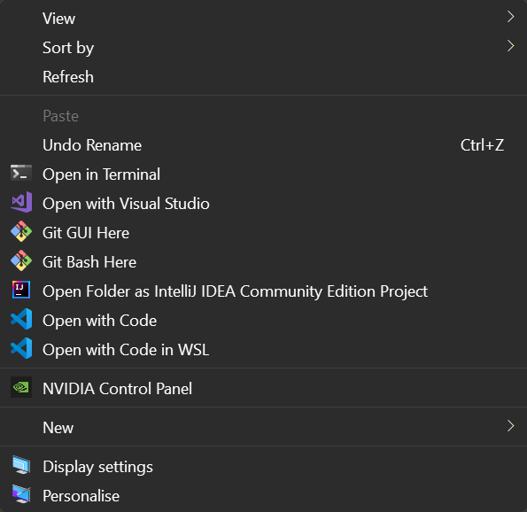

# Open with Code in WSL
> Registry script to add "Open with Code in WSL" items to context menu
___

If it doesn't work for you, make sure that the directory containing the vscode icon and the binaries are set correctly.

### Preview

